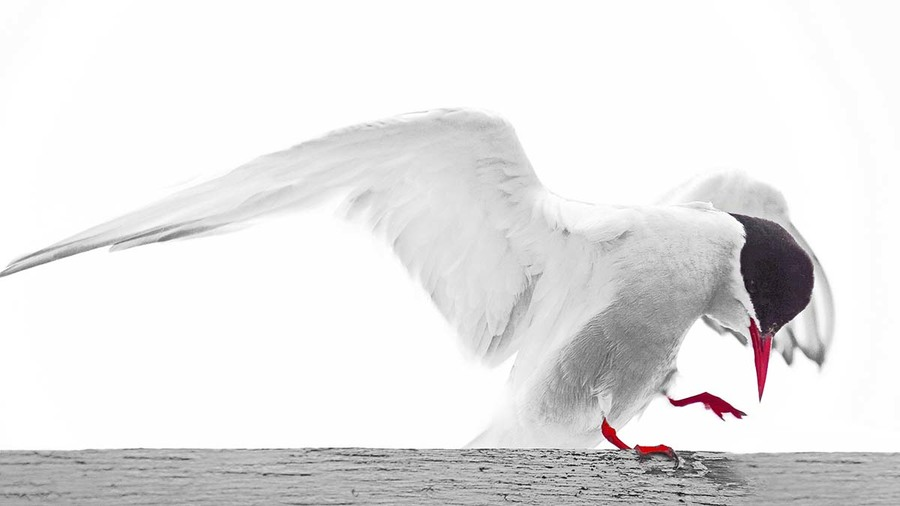

# 迁徙行家
 &nbsp;&nbsp;野生动物的生活并不容易。在生态系统中生存，它们必须获取食物，与竞争对手抗衡，抵御被四处窥视的危险。在很多情况下，它们栖息的地方并不能提供必要的条件，保证它们一年内生存所需。<br>
 &nbsp;&nbsp;大多数动物居有定所，总生活在同一个地方，有时候也会去别处短暂栖息。但是，地球各大陆发展缓慢，气候变化，环境演变，迫使这些物种 
  > 迁徙以求生存。
  
 &nbsp;&nbsp;有些动物迁徙好几千公里，从冬季地区到夏季地区；有些动物，从幼年出生地跋涉至觅食地；也有些动物，会进行端距离的转移，但过程危险重重，艰辛万分。很多情况下，动物的迁徙要付出高昂的代价。接下来会介绍12个物种，响应本性隔代遗传的召唤，意志坚定地进行着令人难以置信的迁徙。

## 目录 
  * [旅鼠](#ls)
  * [美洲野牛](#mzyn)
  * [蓝角马](#ljm)
  * [北极燕鸥](#yo)
  * [燕子](#yz)
  * [蠵龟](#xi_gui)
  * [南非沙丁鱼](#nfsdy)
  * [大西洋鲑鱼](#gy)
  * [鲸鲨](#js)
  * [蚂蚁](#my)
  * [黑脉金斑蝶](#jbd)
  * [圣诞岛红蟹](#hx)


## 北极燕鸥<a id="yo">&nbsp;</a>
*Sterna paradisea*<br>
 

```
这种海鸟优雅潇洒，
比海鸥小巧苗条。
橙色的鸟喙，黑色的冠顶，
还有一条丫杈状的纤细尾巴。 
```
&nbsp;&nbsp;燕鸥是捕鱼能手。它在高处飞翔，脑袋冲下，搜寻食物。当它看到猎物时，便立即一个俯冲，飞扑过去。它能捕获离海面不足15厘米的小鱼和海洋无脊椎动物。<br>
&nbsp;&nbsp;寻找配偶的时候，雄燕鸥全速往上垂直飞行，以此展示自己的力量。雌燕鸥观察着，如果一只雌燕鸥觉得受到吸引，便会朝雄燕鸥飞去。随后，双方慢慢滑翔，比翼飞下。接着，雄燕鸥会捕一条鱼，作为礼物献给雌燕鸥，同时，也为了缓和自己的攻击性。到了地上，它们会跳起一种复杂的舞蹈：它们有节奏地抬起尾巴，垂下翅膀。从此，它们就终生结合在一起，可达30年。<br>
&nbsp;&nbsp;雌燕鸥在鸟窝产下两枚蛋，这对父母会拼命捍卫这个窝巢。对于任何一个入侵者，无论体型多大，它们都会凶狠异常地叼啄攻击。<br>
&nbsp;&nbsp;燕鸥的前脑有一个叫作"B簇"的区域，具有对于磁场特别敏感的神经元。这个器官与眼睛连接在一起，使它们能感受到地球的磁场，感受到视觉形象上的光线和阴影。这样，它朝北看，可以看到一个明亮的弓形；而向南看，也可以看到一个弓形，不过是颠倒的。<br>
**航空冠军**<br>
&nbsp;&nbsp;秋季，燕鸥贪婪进食，积累大量的饱和脂肪，增添足够的能量，以便进行19000公里的史诗般跋涉。燕鸥还会生产大量红细胞，激发动力，加入族群的行列，开始它朝南的旅程。<br>
&nbsp;&nbsp;燕鸥不知冬季为何物，领教了9月的初寒，它就启程迁徙了。飞行过程中，它不远离海岸线，为的是定准自己的方位，在长达两个月的行程里，更容易得到补给，维持生计。<br>&nbsp;&nbsp;到了南极海，它也并不停歇。它要度过南极夏季的这几个月份，飞遍南极周围的海洋，专食磷虾果腹。<br>
&nbsp;&nbsp;南极冬季来临，它回归的旅程便开始了。<br>
&nbsp;&nbsp;燕鸥的迁徙书写在它的基因里。旅程中，它凭借地球磁场、太阳，也凭借自己的经验确定方向。第一次迁徙，父母带着子女，让它们辨识将来必须经历的北冰洋和南极海的路线。年龄越大，它们定位更准，能更好地纠正由于暴风雨和云雾造成的偏航。<br>
&nbsp;&nbsp;北半球夏季期间，燕鸥栖息于欧洲、亚洲和北美洲得北极海岸并在该地建立抚养幼雏得基地。
<br>

**档案卡**<br>
 &nbsp;&nbsp;北极燕鸥的迁移是著名的最大常规迁移。又文献记载，这种禽鸟仅仅再一年之内即可跋涉8万公里。再北极和南极圈内，太阳在夏季是不落得。我们可以说，这是生活在光亮时刻里时间最长得生灵。
|  翼展 |  重量  | 寿命  |
|  ----  | ----  |----  |
|  76-85厘米 | 92-135克  | 20年以上| 

 

## 附录
### 生命之树
 * 脊椎动物
    * 哺乳类
        * 直哺乳亚纲-胎盘哺乳动物（象、倭黑猩猩、海豚）
        * 后哺乳亚纲-无胎盘哺乳动物（袋鼠、考拉）
        * 原哺乳亚纲-卵生哺乳动物（鸭嘴兽）
    * 鸟类
        * 新生代-飞禽（杜鹃、企鹅）
        * 古生代-走禽（鸵鸟、[鹬鸵](#yu_tuo))
### 鹬鸵<a id="yu_tuo">&nbsp;</a>
无翼鸟也叫鹬鸵(yu tuo)，几维鸟。翅膀和尾巴都已退化，嘴长，身长，全身有灰色细长的绒毛，腿短而粗，跑的很快。 昼伏夜出，吃泥土中的昆虫。 产于新西兰，是世界上稀有的鸟类。

### 生存状态
 以下内容排序是由**濒危**到**受到威胁**到**灭绝**
        
 
